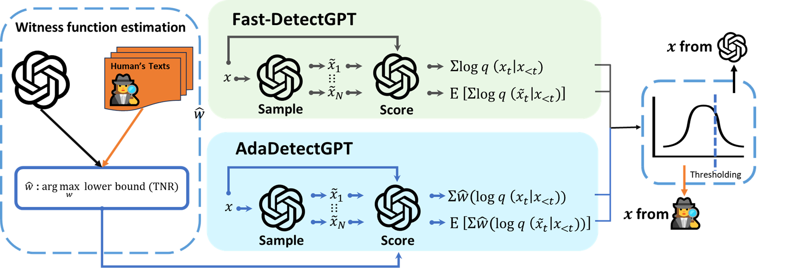

@ -1,44 +0,0 @@
# AdaDetectGPT
**This code is for NeurIPS 2025 paper "AdaDetectGPT: Adaptive Detection of LLM-Generated Text with Statistical Guarantees"**, where we borrow or extend some code from [Fast-DetectGPT](https://github.com/baoguangsheng/fast-detect-gpt).

## Brief Intro


Workflow of AdaDetectGPT. Built upon Fast-DetectGPT, our method adaptively learn a witness function $\hat{w}$ from training data by maximizing a lower bound on the TNR, while using normal approximation for FNR control. 


## Environment
* Python 3.10.8
* PyTorch 2.7.0
* Setup the environment:
  ```bash setup.sh```
  
(Notes: our experiments are run on 1 GPU of H20-NVLink with 96G memory. Our method typically requires much smaller memory than the budget.)


## Reproducibility
**Note**. We share generations from GPT-4o, Gemini-2.5, and Claude-3.5 in exp_gpt3to4/data for convenient reproduction.

- `./exp_whitebox.sh` -> white-box experiments (in Table 1) on 5 LLMs: GPT-2 (1.5B), GPT-Neo (2.7B), OPT-2.7B, GPT-J (6B), GPT-NeoX (20B).
- `./exp_whitebox_advanced.sh` -> white-box experiments on 3 advanced open-sourced LLMs: Qwen-2.5 (7B), Mistralai (7B), Llama3 (8B).
- `./exp_blackbox_advanced.sh` -> black-box experiments on 3 advanced closed-sourced LLM: Gemini-2.5-Flash, GPT-4o, and Claude-3.5-Haiku
- `./exp_blackbox_simple.sh` -> black-box experiments (in Table S2) on 5 five open-sourced LLM: GPT-2 (1.5B), GPT-Neo (2.7B), OPT-2.7B, GPT-J (6B), GPT-NeoX (20B)
- `./exp_sample.sh` -> experiments on studying the effect of training data size (Figure S2)
- `./exp_tuning.sh` -> experiments on studying the robustness of tuning parameters (Figure S3)
- `./exp_dist_shift.sh` -> experiments on studying the effect of distribution shift between training and test data (Figure S4)
- `./exp_attack.sh` -> experiments on adversarial attacks 
- `./exp_compute.sh` -> experiments on studying the computational costs
- `./exp_variance.sh` -> experiments on verifying the equal variance condition

### Citation
If you find this work useful, you can cite it with the following BibTex entry:

```
@inproceedings{zhou2025adadetect,
  title={AdaDetectGPT: Adaptive Detection of LLM-Generated Text with Statistical Guarantees},
  author={Hongyi Zhou and Jin Zhu and Pingfan Su and Kai Ye and Ying Yang and Shakeel A O B Gavioli-Akilagun and Chengchun Shi},
  booktitle={The Thirty-Ninth Annual Conference on Neural Information Processing Systems},
  year={2025}
}
```
